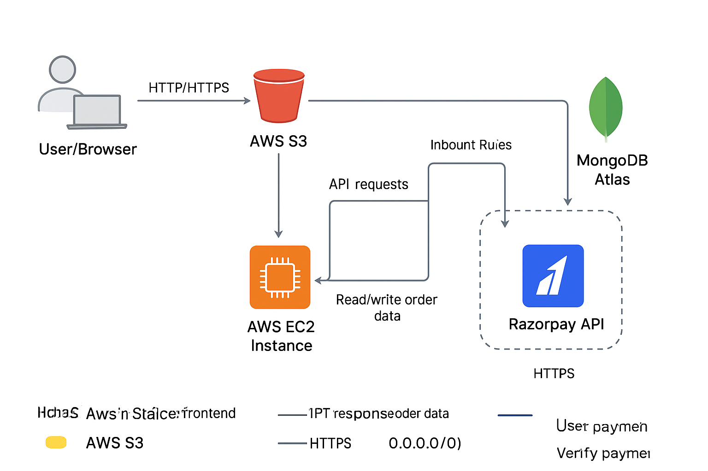
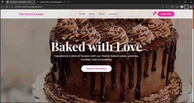

# Cloud-Hosted Bakery E-Commerce Website 🧁

## Description

This project is a fully functional e-commerce website for a fictional bakery, "The Sweet Escape." It allows users to browse items, add them to a cart, and complete a simulated payment using Razorpay's test mode. The application features a static frontend hosted on AWS S3 and a dynamic backend REST API hosted on an AWS EC2 instance, connecting to a MongoDB Atlas database. This project demonstrates a practical application of cloud infrastructure for a web service.

---

## Architecture Diagram 🏗️

This diagram illustrates the cloud infrastructure used for this project:


## Project Demo 🎬

**Note:** The live EC2 backend for this project is currently terminated to save costs. The full functionality, including the Razorpay payment flow, is demonstrated in this video:



* **User:** Accesses the website via a web browser.
* **AWS S3:** Hosts the static frontend files (`index.html`, CSS, JavaScript, images). Provides scalable and durable object storage.
* **AWS EC2:** Hosts the Node.js/Express.js backend server. Provides compute capacity to run the REST API logic.
* **AWS Security Groups:** Act as virtual firewalls controlling traffic to the EC2 instance (allowing HTTP on port 3001 and SSH on port 22).
* **MongoDB Atlas:** A cloud-hosted NoSQL database service used to store order information.
* **Razorpay:** External payment gateway used in test mode to simulate UPI/Card payments.

---

## Features ✨

* **Frontend (Hosted on S3):**
    * Interactive menu display with product details.
    * Shopping cart functionality (add, remove items).
    * Smooth scrolling and subtle animations.
    * Responsive design using Tailwind CSS.
* **Backend (Hosted on EC2):**
    * REST API built with Node.js and Express.js.
    * Endpoint to receive and save customer orders to the database.
    * Endpoint to interact with Razorpay API for creating payment orders.
* **Database (MongoDB Atlas):**
    * Stores customer order details including name, address, phone, cart items, and total amount.
* **Payment Integration (Razorpay):**
    * Integration with Razorpay's checkout system in Test Mode.
    * Simulates UPI/Card payments without using real money.

---

## Cloud Services Used ☁️

* **AWS S3 (Simple Storage Service):**
    * Used for **Static Website Hosting**. S3 provides a cost-effective and highly available way to serve the HTML, CSS, JavaScript, and image files directly to the users' browsers.
    * Configured for public access with a bucket policy.
* **AWS EC2 (Elastic Compute Cloud):**
    * Used to host the **Node.js backend application**. An EC2 instance provides a virtual server where the `server.js` script runs continuously (managed by PM2).
    * A `t2.micro` or `t3.micro` instance (Free Tier eligible) is sufficient for this project.
* **AWS Security Groups:**
    * Act as a **virtual firewall** for the EC2 instance.
    * Configured to allow inbound traffic on:
        * Port `22` (SSH) - Restricted to specific IPs for secure management access.
        * Port `3001` (Custom TCP) - From anywhere (`0.0.0.0/0`) to allow the frontend (S3) to communicate with the backend API.
* **MongoDB Atlas:**
    * A **managed NoSQL database service**. Chosen for its ease of use, scalability, and free tier availability. It stores application data (orders) without requiring manual database server management.
    * Network access configured to allow connections from the EC2 instance's IP address.

---

## Technologies Used 💻

* **Frontend:** HTML, Tailwind CSS, JavaScript
* **Backend:** Node.js, Express.js
* **Database:** MongoDB (via Mongoose ODM)
* **Payment Gateway:** Razorpay SDK
* **Process Manager:** PM2 (for keeping the Node.js server running on EC2)
* **Version Control:** Git & GitHub
**Cloud/DevOps:** AWS (S3, EC2, Security Groups), **Docker**, **GitHub Actions**, Git

---
## CI/CD Pipeline 🚀

* **Frontend (Fully Automated):** Any push to the `frontend/` directory (on the `master` branch) triggers a GitHub Action. This workflow automatically configures AWS credentials and syncs the new frontend files to the S3 bucket, updating the live website in seconds.

* **Backend (Fully Automated):** Any push to the `backend/` directory triggers a GitHub Action that:
    1.  Builds the `Dockerfile` into a new image.
    2.  Pushes the new Docker image to Docker Hub.
    3.  Connects to the EC2 server via SSH to pull the new image and restart the container with the updated code.

*(Note: The live EC2 server is currently terminated to conserve cloud costs, but the full CI/CD workflow is defined in `.github/workflows/backend-deploy.yml` and is ready to run.)*

## Setup Instructions 🛠️

### Prerequisites

* AWS Account
* Node.js and npm installed locally
* Git installed locally
* MongoDB Atlas Account
* Razorpay Account (Test Mode)

### 1. Backend Setup (EC2)

1.  **Launch EC2 Instance:**
    * Choose an AMI (e.g., Amazon Linux 2).
    * Select instance type (e.g., `t3.micro`).
    * Create and download a key pair (`.pem` file).
    * Configure Security Group to allow inbound traffic on ports `22` (from your IP) and `3001` (from Anywhere).
2.  **Connect via SSH:**
    ```bash
    ssh -i "your-key.pem" ec2-user@YOUR_EC2_PUBLIC_IP
    ```
3.  **Install Dependencies:**
    ```bash
    # Install Node.js (using nvm recommended)
    curl -o- [https://raw.githubusercontent.com/nvm-sh/nvm/v0.39.7/install.sh](https://raw.githubusercontent.com/nvm-sh/nvm/v0.39.7/install.sh) | bash
    . ~/.nvm/nvm.sh
    nvm install 20 # Or desired Node version
    # Install Git
    sudo yum update -y
    sudo yum install git -y
    # Install PM2 globally
    sudo npm install pm2 -g
    # Create symlinks for node/npm if needed for PM2 sudo access
    sudo ln -s $(which node) /usr/bin/node
    sudo ln -s $(which npm) /usr/bin/npm
    ```
4.  **Clone Repository:**
    ```bash
    git clone [https://github.com/your-username/your-repo-name.git](https://github.com/Shriarane/aws-bakery-project.git)
    cd your-repo-name/backend
    ```
5.  **Install Backend Packages:**
    ```bash
    npm install
    ```
6. ### 6. Configure Environment Variables

Create a `.env` file in the `backend` directory or set environment variables on your server with the following values:MONGO_URI=YOUR_MONGODB_ATLAS_CONNECTION_STRING 
RAZORPAY_KEY_ID=YOUR_RAZORPAY_TEST_KEY_ID 
RAZORPAY_KEY_SECRET=YOUR_RAZORPAY_TEST_KEY_SECRET
7.  **Start Server with PM2:**
    ```bash
    pm2 start server.js
    pm2 save # Save the process list
    pm2 startup # Follow instructions to enable startup on boot
    ```

### 2. Frontend Setup (S3)

1.  **Create S3 Bucket:**
    * Give it a unique name.
    * **Uncheck "Block all public access"** and acknowledge the warning.
2.  **Enable Static Website Hosting:**
    * In bucket Properties > Static website hosting.
    * Set `index.html` as the Index document.
3.  **Set Bucket Policy:**
    * In bucket Permissions > Bucket policy.
    * Add a policy to allow public read access (replace `YOUR-BUCKET-NAME`):
        ```json
        {
            "Version": "2012-10-17",
            "Statement": [
                {
                    "Sid": "PublicReadGetObject",
                    "Effect": "Allow",
                    "Principal": "*",
                    "Action": "s3:GetObject",
                    "Resource": "arn:aws:s3:::YOUR-BUCKET-NAME/*"
                }
            ]
        }
        ```
4.  **Update Frontend Code:**
    * In your local `frontend/index.html`, ensure the `fetch` URLs point to your EC2 instance's public IP address (e.g., `http://YOUR_EC2_PUBLIC_IP:3001/api/...`).
    * Ensure your Razorpay Key ID is correctly set in the script.
    * Make sure all local image paths are correct (e.g., `images/pastry.jpeg`).
5.  **Upload Frontend Files:**
    * Upload your `index.html` file and the `images` folder to the root of your S3 bucket.

### 3. Access Your Website

* Go to your S3 bucket Properties > Static website hosting section and find your **Bucket website endpoint URL**.

---

## Future Enhancements 🚀

* **Infrastructure as Code (IaC):** Re-build the entire AWS infrastructure (S3, EC2, Security Groups) using **Terraform** to make the environment 100% reproducible and managed as code.
* **Networking & Security (HTTPS):** Use **AWS Route 53** for a custom domain, **AWS Certificate Manager (ACM)** for a free SSL certificate, and **Amazon CloudFront (CDN)** to serve the S3 frontend securely and globally.
* **Serverless Refactor:** Re-architect the backend from a single EC2 instance to a serverless model using **AWS Lambda** and **Amazon API Gateway** to be 100% free-tier compliant and auto-scaling.
* **User Authentication:** Add user signup/login so customers can view their order history.
* **Admin Panel:** Create a secure admin page for managing menu items in the database.

---